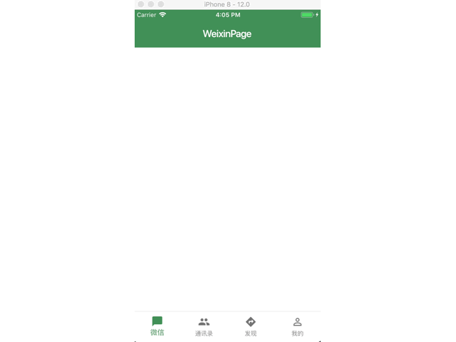
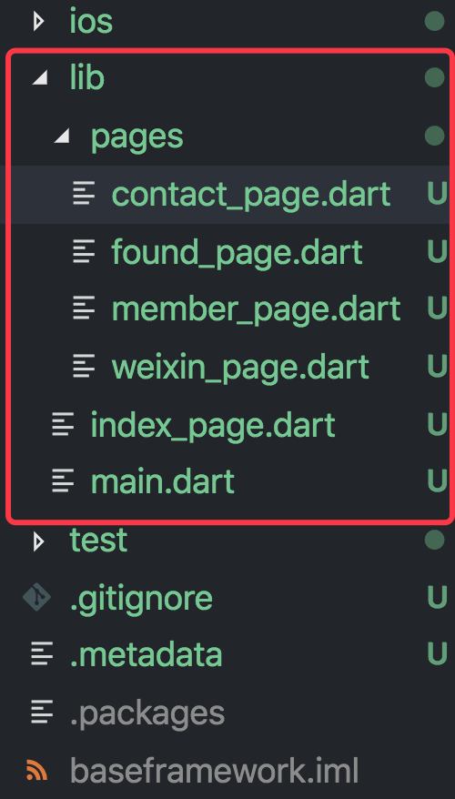

# Flutter 搭建移动端一个简单的项目骨架



在Flutter 中利用系统提供的小部件，来实现基础的项目框架的搭建,实例如上图。

# 1. 重建 `main.dart`
```
import 'package:flutter/material.dart';
import 'index_page.dart';

void main() => runApp(MyApp());

class MyApp extends StatelessWidget {
  @override
  Widget build(BuildContext context) {
    return Container(
      child: MaterialApp(
        debugShowCheckedModeBanner: false,
        theme: ThemeData(
          primaryColor: Color.fromRGBO(67,144,87, 1.0)
        ),
        home: IndexPage(),
      ),
    );
  }
}
```

我们利用`MaterialApp` 这个小部件来构建，将根节点设置成了`Container` 容器，方便我们可以扩展，当然也可以直接利用`MaterialApp` 来构建，我们将`home`属性设置为我们初始化的小部件`IndexPage`,在这个部件中来构建我们基础骨架。

# 2.构建基础骨架

```
import 'package:flutter/material.dart';

class IndexPage extends StatefulWidget {
  @override
  _IndexPageState createState() => _IndexPageState();
}

class _IndexPageState extends State<IndexPage> {

  @override
  Widget build(BuildContext context) {
    return Scaffold(
      backgroundColor: Colors.white,
    );
  }
}
```
这里我们需要使用的是 `StatefulWidget`.

# 3. 构建BottomNavigationBar

我们需要 `Scaffold` 这个脚手架的小部件来构建我们的底部`bottomNavigationBar`,我们需要利用`material ` 中提供的`BottomNavigationBar` 来构建.

```
BottomNavigationBar(
        type:BottomNavigationBarType.fixed,
        items: ,
        currentIndex: ,
        onTap: ,
      )
```
我们可以发现 `BottomNavigationBar` 需要提供 `items`,也就是每一个Item项,我们可以通过创建一个列表的实现：
```
List<BottomNavigationBarItem> _items = [
      BottomNavigationBarItem(
        icon: Icon(Icons.chat_bubble),
        title: Text('微信')
      ),
      BottomNavigationBarItem(
        icon: Icon(Icons.group),
        title: Text('通讯录')
      ),
      BottomNavigationBarItem(
        icon: Icon(Icons.directions),
        title: Text('发现')
      ),
      BottomNavigationBarItem(
        icon: Icon(Icons.person_outline),
        title: Text('我的')
      )
  ];
```
`BottomNavigationBar` 中 `currentIndex ` 指的是当前选择的是哪一个`Item`项，`onTap `是一个点击某一项的回调函数，会将当前点击的`index`传递过来，这样我们就需要定义一个`currentIndex`变量来进行动态改变:
```
int _currentIndex = 0;
```
# 4. 构建页面

在`Scaffold` 的 `body`属性中我们需要设置当前页面，为了方便动态切换页面，我们首先创建与`Item`相互匹配的页面:

```
import 'package:flutter/material.dart';

class WeixinPage extends StatelessWidget {
  @override
  Widget build(BuildContext context) {
    return Scaffold(
      appBar: AppBar(
        title: Text('WeixinPage'),
        elevation: 0.0,
      ),
    );
  }
}

import 'package:flutter/material.dart';

class MemberPage extends StatelessWidget {
  @override
  Widget build(BuildContext context) {
    return Scaffold(
      appBar: AppBar(
        title: Text('MemberPage'),
        elevation: 0.0,
      ),
    );
  }
}

import 'package:flutter/material.dart';

class FoundPage extends StatelessWidget {
  @override
  Widget build(BuildContext context) {
    return Scaffold(
      appBar: AppBar(
        title: Text('FoundPage'),
        elevation: 0.0,
      ),
    );
  }
}
import 'package:flutter/material.dart';

class ContactPage extends StatelessWidget {
  @override
  Widget build(BuildContext context) {
    return Scaffold(
      appBar: AppBar(
        title: Text('ContactPage'),
        elevation: 0.0,
      ),
    );
  }
}
```

项目结构如下：




# 5. 设置页面切换

我们需要在`index_page.dart`中将之前创建的页面引入，
然后在创建一个页面列表：

```
 List<Widget> _pages = [
   WeixinPage(),
   FoundPage(),
   MemberPage(),
   ContactPage()
 ];
```
完整的 `Scaffold ` 如下：

```
@override
  Widget build(BuildContext context) {
    return Scaffold(
      backgroundColor: Colors.white,
      body: IndexedStack(
        index: _currentIndex,
        children: _pages,
      ),
      bottomNavigationBar: BottomNavigationBar(
        type:BottomNavigationBarType.fixed,
        items: _items,
        currentIndex: _currentIndex,
        onTap: (index){
          setState(() {
             _currentIndex = index;
          });
        },
      ),
    )
```

这样我们就实现了上述基本的项目骨架。


